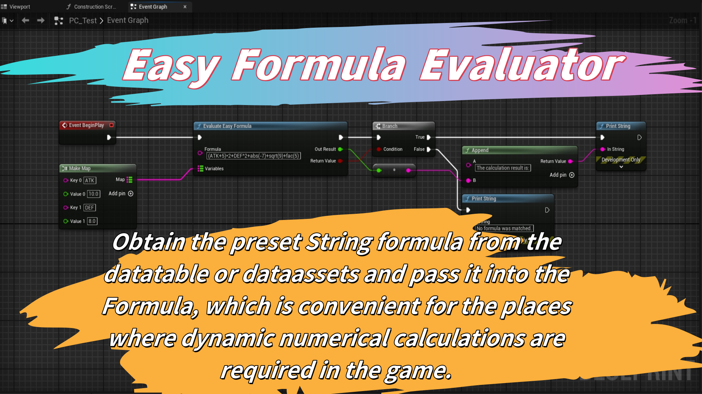
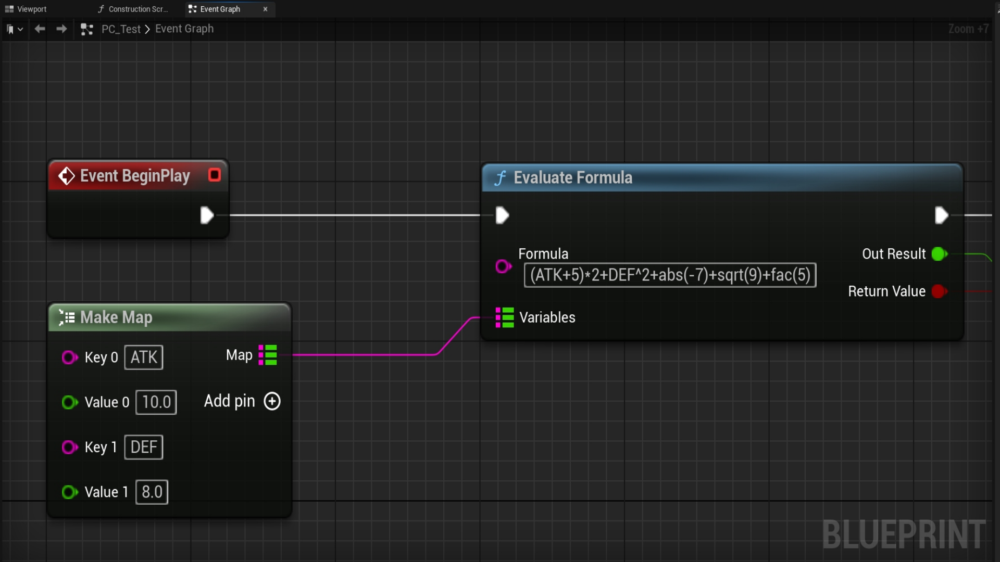

# EasyFormulaEvaluator
# Easy Formula Evaluator Plugin

## 1. After downloading from the Fab Market, search for "Easy Formula Evaluator" in your UE plugin, check it, and then restart the UE.

## 2. The plugin has only one simple and easy-to-use function, and it contains only one node. It includes operators with basic support, such as +, -, *, /, %, etc. It follows the mathematical calculation order of priority from left to right. Therefore, for operations with lower priority, parentheses "() "need to be used to increase the priority.  

## 3. When you place the mouse cursor on the node, the supported types of evaluation functions will be displayed. It should be particularly noted that for calculations like sin and cos, the results are in radians, not in degrees. 
## 4. It is strongly recommended that variable names be written in all capital letters, and function names be written in all lowercase letters. Of course, variable names can use other languages such as Japanese, Korean, Chinese, and so on. 
## 5. You can place "Formula" and "Mapping" in a data table, a data asset, or anywhere else where you manage data. In this way, you can dynamically manage the data within it. 

